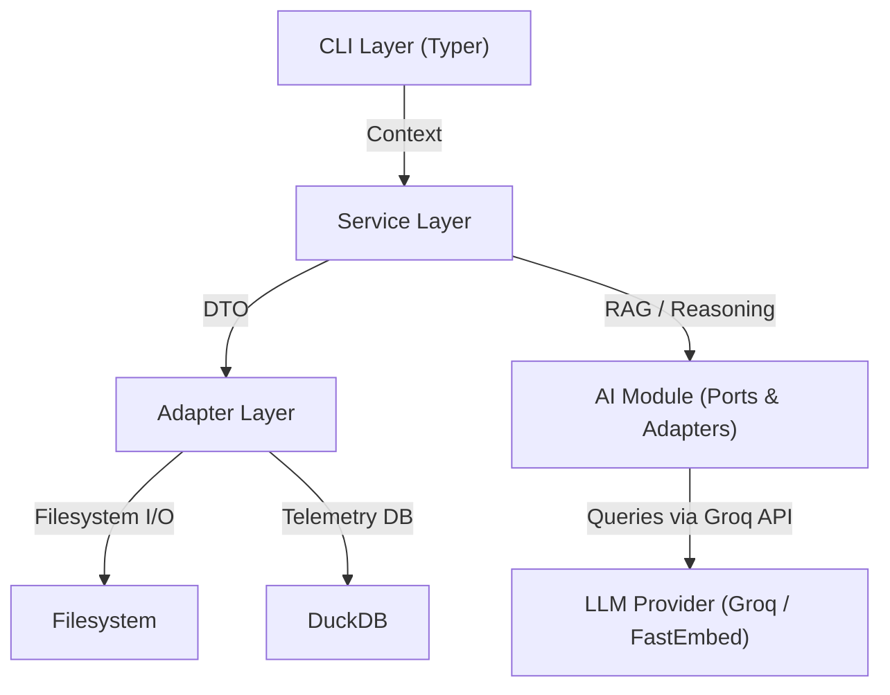

# Architecture Guide: DevBase v5.1.0

This document explains the internal design of DevBase, intended for contributors and maintainers.

## 🏗️ High-Level Design

DevBase v5.1.0 follows a strict **Command-Service-Adapter** pattern to ensure testability, separation of concerns, and modularity.



### 1. CLI Layer ([`src/devbase/commands/`](src/devbase/commands/))
- **Technology**: `typer` + `rich`
- **Role**: Entry point. Handles argument parsing, validation, and UI output.
- **Rules**:
    - NO business logic.
    - MUST catch exceptions and print friendly errors.
    - MUST use `rich` for all output.

### 2. Service Layer ([`src/devbase/services/`](src/devbase/services/))
- **Technology**: Pure Python
- **Role**: Orchestrates business logic.
- **Rules**:
    - Platform-agnostic.
    - Does NOT print to console (returns data/objects).
    - Can be imported by other services.

### 3. Adapter Layer ([`src/devbase/utils/`](src/devbase/utils/) & [`src/devbase/adapters/`](src/devbase/adapters/))
- **Technology**: `pathlib`, `json`, `duckdb`
- **Role**: Interfaces with the outside world.
- **Rules**:
    - Handles low-level I/O.
    - Implements "Dry Run" logic.
    - Manages state persistence (`.devbase_state.json`).

### 4. AI Module ([`src/devbase/ai/`](src/devbase/ai/)) — Ports & Adapters
- **Technology**: Groq SDK, FastEmbed
- **Role**: Abstracted LLM provider interface with concrete implementations.
- **Rules**:
    - `interface.py` defines the `LLMProvider` ABC (Port).
    - `providers/` contains concrete adapters (e.g., `groq.py`).
    - `exceptions.py` provides the hierarchical exception tree.
    - `models.py` defines Pydantic response models.

---

## 🛠️ Technology Stack

| Component | Library | Reason |
| :--- | :--- | :--- |
| **CLI Framework** | `typer` | Modern, type-safe, practically zero boilerplate. |
| **Terminal UI** | `rich` | Beautiful output, tables, and progress bars are essential for DX. |
| **Packaging** | `uv` | Orders of magnitude faster than Pip/Poetry. Simplifies venv management. |
| **Linting/Format** | `ruff` | Single tool replacing black, isort, flake8. Ultra-fast. |
| **Analytics** | `duckdb` | Embedded OLAP database for fast querying of telemetry logs. |
| **Templating** | `jinja2` | Industry standard, flexible, sandboxed. |
| **Scaffolding** | `copier` | Powerful project templating and updates. |
| **Knowledge Graph** | `networkx` | Graph algorithms for PKM linking and analysis. |
| **Metadata** | `python-frontmatter` | Parses YAML frontmatter in Markdown notes. |
| **AI (Remote)** | `groq` | Ultra-fast LLM inference API. |
| **AI (Local)** | `fastembed` | Local vector embedding generation for RAG. |
| **Type Checking** | `mypy` | Static type analysis with strict mode. |
| **Build System** | `hatchling` | PEP 517-compliant, lightweight. |
| **Release** | `python-semantic-release` | Automated versioning from commit messages. |

---

## 📂 Project Structure

```text
src/devbase/
├── __init__.py              # Version via importlib.metadata
├── main.py                  # Application Entry Point (Typer)
│
├── commands/                # CLI Groups (Progressive Disclosure)
│   ├── core.py              # Setup, Doctor, Hydrate
│   ├── dev/                 # Development commands (split package)
│   │   ├── __init__.py      # Re-assembles Typer app
│   │   ├── project.py       # new, import, open, list, archive, update, restore
│   │   ├── scaffold.py      # blueprint, adr-gen
│   │   ├── audit.py         # Naming convention audit
│   │   └── worktree.py      # worktree-add, worktree-list, worktree-remove
│   ├── navigation.py        # Quick folder navigation
│   ├── operations.py        # Track, backup
│   ├── quick.py             # Shortcut commands
│   ├── docs.py              # Documentation generation
│   ├── pkm.py               # Knowledge graph & linking
│   ├── study.py             # Spaced repetition & synthesis
│   ├── analytics.py         # Productivity insights
│   ├── ai.py                # AI-powered features (organize, chat, classify)
│   ├── audit.py             # Workspace consistency checks
│   ├── security_check.py    # Security scanning
│   └── debug.py             # Debug utilities
│
├── services/                # Business Logic (Platform-agnostic)
│   ├── blueprint_service.py # AI-powered project scaffolding
│   ├── project_setup.py     # Golden Path project setup
│   ├── routine_agent.py     # Daily briefings & triage
│   ├── search_engine.py     # Local RAG & vector search
│   ├── adr_generator.py     # Architecture Decision Records
│   ├── async_worker.py      # Background AI task processing
│   ├── cognitive_detector.py # Cognitive load detection
│   ├── knowledge_db.py      # Knowledge graph database
│   ├── notifications.py     # User notification service
│   ├── llm_interface.py     # DEPRECATED — shim to ai/interface
│   └── security/
│       └── sanitizer.py     # 4-layer context sanitization pipeline
│
├── ai/                      # AI Module (Ports & Adapters)
│   ├── interface.py         # LLMProvider ABC (Port)
│   ├── models.py            # Pydantic response models
│   ├── exceptions.py        # Hierarchical AI exception tree
│   ├── service.py           # AIService orchestrator
│   └── providers/
│       └── groq.py          # Groq API adapter (Llama models)
│
├── adapters/                # External I/O Adapters
│   ├── ai/
│   │   └── groq_adapter.py  # Legacy Groq adapter (generate/classify/summarize)
│   └── storage/
│       └── duckdb_adapter.py # DuckDB connection, schema, FTS
│
├── config/
│   └── taxonomy.py          # Johnny.Decimal taxonomy SSOT
│
├── utils/                   # Shared Utilities
│   ├── filesystem.py        # Atomic file operations
│   ├── workspace.py         # Workspace root detection
│   ├── wizard.py            # Interactive setup prompts
│   ├── telemetry.py         # Event logging (DuckDB)
│   ├── templates.py         # Copier/Jinja2 templating
│   ├── paths.py             # Path resolution utilities
│   ├── vscode.py            # VS Code workspace generation
│   ├── worktree.py          # Git worktree operations
│   ├── nuget.py             # NuGet package restore
│   ├── icons.py             # Folder icon management
│   └── state.py             # State persistence
│
└── templates/               # Built-in project templates
    ├── core/                # Core workspace templates
    └── code/                # Code project templates
```

---

## 🔄 Data Flow: "Creating a Project"

When a user runs `devbase dev new my-api`:

1.  **CLI (`commands/dev/project.py`)**:
    - Parses `my-api`.
    - Validates kebab-case naming.
    - Instantiates `Console` and `Context`.

2.  **Service (`services/project_setup.py`)**:
    - Receives request.
    - Calls `utils/wizard.py` if interactive questions are needed.
    - Determines target path in `20-29_CODE`.

3.  **Adapter (`utils/templates.py`)**:
    - Loads `clean-arch` template.
    - Renders Jinja2/Copier files with context variables.
    - Writes files to disk using `utils/filesystem.py` (Atomic Write).

4.  **Side Effect**:
    - `devbase ops track` is called internally to log the "Project Created" event.

---

## 🧪 Testing Strategy

We prioritize **Integration Tests** over Unit Tests for the CLI.

- **Tools**: `pytest`, `pytest-cov`
- **Pattern**: Invoke CLI commands against a temporary directory via `CliRunner`.
- **Coverage Goal**: >80% for `commands/` and `services/`.

```bash
# Run tests
uv run pytest

# Run with coverage
uv run pytest --cov=devbase --cov-report=term-missing
```

---

## 🔧 Development Setup

```bash
# Clone and setup
git clone <repo-url>
cd devbase-setup
uv sync

# Run CLI
uv run devbase --help

# Run tests
uv run pytest -v

# Lint and format
uv run ruff check src/ tests/
uv run ruff format src/ tests/
```

Or use the DevContainer (`.devcontainer/devcontainer.json`) for a deterministic environment.

---

© 2024-2026 DevBase Team
