# 🚀 DevBase v5.1 — Workflow Consolidado

**Versão:** 5.1 (Consolidação Auditada)  
**Base:** v4.0 + Cherry-picks de v5.0  
**Princípio:** _"A melhor automação é a que desaparece."_

---

## Stack Core (Inviolável)

| Requisito | Spec | Enforcement |
|-----------|------|-------------|
| Cold Start | < 50ms | Benchmark CI gate |
| IA Path Crítico | Proibido | Zero chamadas síncronas |
| Personas Manuais | Proibido | Detecção automática |
| Busca | < 200ms | TDD v1.2 RP01 |

---

## 1. DuckDB: WAL + Schema

```python
# adapters/storage/duckdb_adapter.py
import atexit
import signal

def init_connection(db_path: Path) -> duckdb.DuckDBPyConnection:
    """WAL com valor fixo SSD (funciona para todos os casos)."""
    conn = duckdb.connect(str(db_path))
    conn.execute("PRAGMA wal_autocheckpoint=1000;")  # Fixo, zero I/O
    
    # Shutdown handlers (cherry-pick v5.0)
    def shutdown(conn=conn):
        conn.execute("PRAGMA wal_checkpoint(RESTART);")
        conn.close()
    
    atexit.register(shutdown)
    signal.signal(signal.SIGTERM, lambda s, f: shutdown())
    
    return conn
```

```sql
-- Schema com constraints
CREATE TABLE notes_index (
    file_path TEXT PRIMARY KEY,
    content_hash TEXT NOT NULL,
    jd_category TEXT CHECK(jd_category GLOB '[0-9][0-9]-[0-9][0-9]_*'),
    tags TEXT CHECK(json_valid(tags)),
    maturity TEXT CHECK(maturity IN ('draft', 'review', 'stable', 'deprecated')),
    mtime_epoch INTEGER NOT NULL
);

-- FTS Hot/Cold (cherry-pick v5.0)
CREATE VIRTUAL TABLE hot_fts USING fts5(
    content, file_path UNINDEXED, jd_category UNINDEXED,
    tokenize='porter'
);

CREATE VIRTUAL TABLE cold_fts USING fts5(
    content, file_path UNINDEXED, jd_category UNINDEXED,
    tokenize='porter'
);

-- View unificada
CREATE VIEW unified_search AS
SELECT *, 1 as priority FROM hot_fts WHERE content MATCH ?
UNION ALL
SELECT *, 2 as priority FROM cold_fts WHERE content MATCH ?
ORDER BY priority, rank;

-- Queue async
CREATE TABLE ai_task_queue (
    id INTEGER PRIMARY KEY,
    task_type TEXT CHECK(task_type IN ('classify', 'synthesize', 'summarize')),
    payload TEXT NOT NULL,
    status TEXT DEFAULT 'pending' CHECK(status IN ('pending', 'processing', 'done', 'failed')),
    created_at TEXT DEFAULT (datetime('now'))
);
```

---

## 2. Detecção Cognitiva (v4.0 Simples)

```python
# services/cognitive_detector.py
COGNITIVE_TRIGGERS = {
    'attack': ['critic', 'flaw', 'risk', 'security', 'fail', 'wrong', 'crítica', 'falha', 'risco'],
    'explore': ['idea', 'alternative', 'explore', 'brainstorm', 'what if', 'ideia', 'alternativa'],
    'document': ['document', 'adr', 'spec', 'reference', 'formalize', 'documentar', 'referência']
}

def detect_cognitive_mode(prompt: str) -> str:
    """Detecção O(n) simples - SEM voting, SEM I/O, SEM DB query."""
    prompt_lower = prompt.lower()
    for mode, keywords in COGNITIVE_TRIGGERS.items():
        if any(kw in prompt_lower for kw in keywords):
            return mode
    return 'neutral'
```

---

## 3. Sanitização 4 Camadas (v4.0 Seguro)

```python
# services/security/sanitizer.py
def sanitize_context(raw: str, config: SecurityConfig) -> SanitizedContext:
    """4 camadas - NUNCA audita raw."""
    # Layer 1: Remoção de secrets
    step1 = remove_secrets(raw, config.secrets_patterns)
    
    # Layer 2: Anonimização (hash + salt rotativo)
    step2 = anonymize_paths(step1, salt=config.daily_salt)
    
    # Layer 3: Truncagem
    step3 = truncate_tokens(step2, max_tokens=2000)
    
    # Layer 4: Assinatura
    signature = hashlib.sha256(step3.encode()).hexdigest()
    
    # Auditoria via HASH apenas (NUNCA raw)
    audit_log(signature, datetime.now(), hash(config.user_id))
    
    return SanitizedContext(content=step3, signature=signature)

# Padrões de secrets
SECRETS_PATTERNS = [
    r"(?i)(api[_-]?key|secret|password|token)\s*[:=]",
    r"sk-[a-zA-Z0-9]{48}",   # OpenAI
    r"ghp_[a-zA-Z0-9]{36}",  # GitHub PAT
    r"AKIA[0-9A-Z]{16}",     # AWS
]
```

---

## 4. Quotas Hard Enforcement

```toml
# ~/.devbase/config.toml
[ai]
enabled = false          # Default: OFF
provider = "groq"
async_only = true        # Hard-block síncronas

[security.ai_generation]
max_daily_artifacts = 5
human_approval_required = true
blocked_paths = [
    "12_private_vault/",
    "*.env",
    "credentials/",
    "*secret*"
]
```

```python
# services/security/enforcer.py
class SecurityEnforcer:
    def enforce(self, path: str, user: str) -> None:
        # Blocked paths
        for pattern in self.cfg.blocked_paths:
            if fnmatch.fnmatch(path.lower(), pattern.lower()):
                raise SecurityError(f"BLOCKED: {path}")
        
        # Quota diária
        if self.tracker.get_count(user) >= self.cfg.max_daily:
            raise QuotaExceeded("Daily limit reached")
        
        self.tracker.increment(user)
```

---

## 5. Rabbit-Hole Detection (v4.0)

```python
# services/productivity_monitor.py
PROGRESS_THRESHOLDS = {
    "files_modified": 1,
    "tests_passing_ratio": 0.8,
    "linter_score": 95
}

def detect_rabbit_hole(session_metrics: dict) -> bool:
    """Detecção automática com intervenção proativa."""
    at_risk = (
        session_metrics.get('prompt_iterations', 0) > 3 and
        session_metrics.get('code_committed', 0) == 0 and
        session_metrics.get('time_spent_minutes', 0) > 12
    )
    
    if at_risk:
        console.print("[yellow]⚠ Padrão 'rabbit-hole' detectado.[/]")
        console.print("[yellow]Sugestão: Código manual ou revisão humana.[/]")
    
    return at_risk
```

---

## 6. Taxonomia JD (Single Source of Truth)

```python
# config/taxonomy.py
"""Single Source of Truth para categorias JD v5.0."""

JD_AREAS = frozenset({
    "00-09_SYSTEM",
    "10-19_KNOWLEDGE", 
    "20-29_CODE",
    "30-39_OPERATIONS",
    "40-49_MEDIA",
    "90-99_ARCHIVE",
})

JD_PATTERN = r"[0-9]{2}-[0-9]{2}_[A-Z_]+"

def validate_jd_category(category: str) -> bool:
    """Validação centralizada - usada em SQL e Python."""
    import re
    if not re.match(JD_PATTERN, category):
        return False
    area = category.split("_")[0]  # "00-09"
    return any(category.startswith(a.split("_")[0]) for a in JD_AREAS)
```

---

## 7. Arquitetura Async (Fire-and-Forget)

```mermaid
sequenceDiagram
    participant U as User
    participant CLI as CLI (<50ms)
    participant FS as Filesystem
    participant Q as DuckDB Queue
    participant W as Background Worker
    participant AI as Groq API

    U->>CLI: devbase quick "nota"
    CLI->>FS: Salva .md
    CLI->>Q: Enfileira classificação
    CLI-->>U: ✓ Nota salva (<50ms)
    
    Note over W,AI: Worker separado
    W->>Q: Poll pending
    W->>AI: Classifica
    W->>FS: Atualiza metadata
    W-->>U: Desktop notification
```



| Comando | Online | Offline |
|---------|--------|---------|
| `quick "nota"` | Salva + enfileira | Salva only |
| `search` | Local only | Local only |
| `search --ai` | Local + enfileira síntese | Local + warning |
| `ai adr "X"` | Enfileira geração | Template MADR vazio |

---

## 8. Background Worker (Implementação)

> **Decisão:** Thread interna com daemon=True (não processo separado).
> **Justificativa:** Simplicidade > complexidade. Processo separado requer IPC, systemd, etc.

```python
# services/async_worker.py
import threading
import time
from queue import Empty

class AIWorker:
    """Worker thread para processamento async de tarefas AI."""
    
    def __init__(self, db_path: Path, poll_interval: float = 5.0):
        self.db_path = db_path
        self.poll_interval = poll_interval
        self._stop_event = threading.Event()
        self._thread: threading.Thread | None = None
    
    def start(self) -> None:
        """Inicia worker como daemon thread."""
        if self._thread and self._thread.is_alive():
            return
        
        self._stop_event.clear()
        self._thread = threading.Thread(
            target=self._run_loop,
            name="devbase-ai-worker",
            daemon=True  # Morre com o processo principal
        )
        self._thread.start()
    
    def stop(self, timeout: float = 5.0) -> None:
        """Para worker graciosamente."""
        self._stop_event.set()
        if self._thread:
            self._thread.join(timeout=timeout)
    
    def _run_loop(self) -> None:
        """Loop principal do worker."""
        conn = duckdb.connect(str(self.db_path), read_only=False)
        
        while not self._stop_event.is_set():
            try:
                task = self._fetch_next_task(conn)
                if task:
                    self._process_task(conn, task)
                else:
                    time.sleep(self.poll_interval)
            except Exception as e:
                log_error(f"Worker error: {e}")
                time.sleep(self.poll_interval * 2)
        
        conn.close()
    
    def _fetch_next_task(self, conn) -> dict | None:
        """Busca próxima tarefa pendente (FIFO)."""
        result = conn.execute("""
            UPDATE ai_task_queue 
            SET status = 'processing'
            WHERE id = (
                SELECT id FROM ai_task_queue 
                WHERE status = 'pending' 
                ORDER BY created_at 
                LIMIT 1
            )
            RETURNING *
        """).fetchone()
        return dict(result) if result else None
    
    def _process_task(self, conn, task: dict) -> None:
        """Processa tarefa e atualiza status."""
        try:
            result = self._dispatch_task(task)
            conn.execute(
                "UPDATE ai_task_queue SET status = 'done' WHERE id = ?",
                [task['id']]
            )
            self._notify_completion(task, result)
        except Exception as e:
            conn.execute(
                "UPDATE ai_task_queue SET status = 'failed' WHERE id = ?",
                [task['id']]
            )
            log_error(f"Task {task['id']} failed: {e}")
    
    def _dispatch_task(self, task: dict) -> str:
        """Dispatch por tipo de tarefa."""
        handlers = {
            'classify': self._handle_classify,
            'synthesize': self._handle_synthesize,
            'summarize': self._handle_summarize,
        }
        handler = handlers.get(task['task_type'])
        if not handler:
            raise ValueError(f"Unknown task type: {task['task_type']}")
        return handler(task['payload'])
```

**Integração no CLI:**
```python
# main.py
from services.async_worker import AIWorker

_worker: AIWorker | None = None

def get_worker() -> AIWorker:
    global _worker
    if _worker is None:
        _worker = AIWorker(get_db_path())
        if load_config().ai.enabled:
            _worker.start()
    return _worker

# Chamado em shutdown
atexit.register(lambda: _worker.stop() if _worker else None)
```

---

## 9. Desktop Notifications (Cross-Platform)

> **Decisão:** Usar `plyer` (MIT license, cross-platform).
> **Fallback:** Silencioso se `plyer` não instalado (dependency opcional).

```toml
# pyproject.toml
[project.optional-dependencies]
notifications = ["plyer>=2.1.0"]
```

```python
# services/notifications.py
from typing import Protocol

class Notifier(Protocol):
    def notify(self, title: str, message: str) -> None: ...

class PlyerNotifier:
    """Notificador cross-platform via plyer."""
    
    def __init__(self):
        try:
            from plyer import notification
            self._notification = notification
            self._available = True
        except ImportError:
            self._available = False
    
    def notify(self, title: str, message: str) -> None:
        if not self._available:
            return  # Silencioso se não instalado
        
        self._notification.notify(
            title=title,
            message=message,
            app_name="DevBase",
            timeout=5
        )

class ConsoleNotifier:
    """Fallback para console."""
    
    def notify(self, title: str, message: str) -> None:
        console.print(f"[blue]📢 {title}:[/] {message}")

def get_notifier() -> Notifier:
    """Factory baseada em config."""
    config = load_config()
    
    if config.ai.notification == "desktop":
        notifier = PlyerNotifier()
        if notifier._available:
            return notifier
    
    return ConsoleNotifier()
```

**Config:**
```toml
# ~/.devbase/config.toml
[ai]
notification = "desktop"  # "desktop" | "console" | "none"
```

---

## 10. JD Validation Strategy

> **Decisão:** Validação apenas em runtime Python (não gera SQL dinamicamente).
> **Justificativa:** SQL CHECK constraints são para formato, não valores. Evita acoplamento.

```python
# config/taxonomy.py
"""Single Source of Truth - JD v5.0 Taxonomy."""
import re
from pathlib import Path
from typing import NamedTuple

class JDCategory(NamedTuple):
    area: str      # "10-19"
    name: str      # "KNOWLEDGE"
    full: str      # "10-19_KNOWLEDGE"

JD_TAXONOMY: dict[str, JDCategory] = {
    "00-09": JDCategory("00-09", "SYSTEM", "00-09_SYSTEM"),
    "10-19": JDCategory("10-19", "KNOWLEDGE", "10-19_KNOWLEDGE"),
    "20-29": JDCategory("20-29", "CODE", "20-29_CODE"),
    "30-39": JDCategory("30-39", "OPERATIONS", "30-39_OPERATIONS"),
    "40-49": JDCategory("40-49", "MEDIA", "40-49_MEDIA"),
    "90-99": JDCategory("90-99", "ARCHIVE", "90-99_ARCHIVE"),
}

JD_PATTERN = re.compile(r"^([0-9]{2})-([0-9]{2})_([A-Z_]+)$")

def validate_jd_path(path: Path) -> bool:
    """Valida se path segue taxonomia JD."""
    for part in path.parts:
        match = JD_PATTERN.match(part)
        if match:
            area_start, area_end, name = match.groups()
            area_key = f"{area_start}-{area_end}"
            if area_key not in JD_TAXONOMY:
                return False
            if JD_TAXONOMY[area_key].name != name:
                return False
    return True

def get_jd_area_for_path(path: Path) -> JDCategory | None:
    """Retorna área JD para um path."""
    for part in path.parts:
        match = JD_PATTERN.match(part)
        if match:
            area_key = f"{match.group(1)}-{match.group(2)}"
            return JD_TAXONOMY.get(area_key)
    return None

# SQL usa apenas CHECK de formato (imutável)
SQL_JD_CHECK = "jd_category GLOB '[0-9][0-9]-[0-9][0-9]_*'"
```

**Uso no CLI:**
```python
# commands/pkm.py
@app.command()
def new(name: str, jd_area: str):
    from config.taxonomy import JD_TAXONOMY, validate_jd_path
    
    if jd_area not in JD_TAXONOMY:
        valid = ", ".join(JD_TAXONOMY.keys())
        raise typer.BadParameter(f"Área inválida. Use: {valid}")
    
    target = get_pkm_root() / JD_TAXONOMY[jd_area].full / name
    # ...
```

---

## 11. Migration: v5.0 → v5.1

> **Cenário:** Usuários com schema v5.0 (sem Hot/Cold FTS).

```python
# services/migration.py
from pathlib import Path
import duckdb

MIGRATIONS = {
    "5.0_to_5.1": """
        -- Criar tabelas Hot/Cold FTS se não existem
        CREATE TABLE IF NOT EXISTS hot_fts_migration AS 
        SELECT * FROM notes_fts WHERE 1=0;
        
        CREATE VIRTUAL TABLE IF NOT EXISTS hot_fts USING fts5(
            content, file_path UNINDEXED, jd_category UNINDEXED,
            tokenize='porter'
        );
        
        CREATE VIRTUAL TABLE IF NOT EXISTS cold_fts USING fts5(
            content, file_path UNINDEXED, jd_category UNINDEXED,
            tokenize='porter'
        );
        
        -- Migrar dados: últimos 7 dias → hot, resto → cold
        INSERT INTO hot_fts 
        SELECT content, file_path, jd_category 
        FROM notes_index 
        WHERE mtime_epoch > (unixepoch() - 604800);
        
        INSERT INTO cold_fts 
        SELECT content, file_path, jd_category 
        FROM notes_index 
        WHERE mtime_epoch <= (unixepoch() - 604800);
        
        -- Criar view unificada
        CREATE VIEW IF NOT EXISTS unified_search AS
        SELECT *, 1 as priority FROM hot_fts WHERE content MATCH ?
        UNION ALL
        SELECT *, 2 as priority FROM cold_fts WHERE content MATCH ?
        ORDER BY priority, rank;
        
        -- Atualizar versão
        CREATE TABLE IF NOT EXISTS schema_version (version TEXT PRIMARY KEY);
        INSERT OR REPLACE INTO schema_version VALUES ('5.1');
    """
}

def get_current_version(conn: duckdb.DuckDBPyConnection) -> str:
    """Retorna versão atual do schema."""
    try:
        result = conn.execute(
            "SELECT version FROM schema_version LIMIT 1"
        ).fetchone()
        return result[0] if result else "5.0"
    except:
        return "5.0"

def migrate(db_path: Path) -> bool:
    """Executa migrações pendentes."""
    conn = duckdb.connect(str(db_path))
    current = get_current_version(conn)
    
    if current == "5.1":
        console.print("[green]✓ Schema já está em v5.1[/]")
        return False
    
    console.print(f"[yellow]Migrando schema: {current} → 5.1[/]")
    
    migration_key = f"{current}_to_5.1"
    if migration_key not in MIGRATIONS:
        raise ValueError(f"Caminho de migração não encontrado: {migration_key}")
    
    conn.execute(MIGRATIONS[migration_key])
    conn.close()
    
    console.print("[green]✓ Migração concluída[/]")
    return True
```

**Comando CLI:**
```bash
devbase core migrate  # Executa migrações pendentes
devbase core migrate --dry-run  # Mostra o que seria feito
```

---

## 12. Edge Cases

### Network Drives
```toml
[performance]
low_latency_mode = true
use_checksums = true  # Hash ao invés de mtime
```

### Multi-Workspace
```bash
export DEVBASE_CONTEXT="work"
devbase nav goto code  # → work/20-29_CODE/
```

---

## 13. Checklist P0

- [x] WAL autocheckpoint fixo (1000)
- [x] Shutdown handlers (atexit + SIGTERM)
- [x] Hot/Cold FTS separation
- [x] Detecção cognitiva simples (keyword match)
- [x] Sanitização 4 camadas (sem audit_full)
- [x] Quotas hard enforcement
- [x] IA disabled by default
- [x] Taxonomia JD como SSOT Python
- [x] Zero personas/roles manuais
- [x] Background Worker (daemon thread)
- [x] Desktop Notifications (plyer + fallback)
- [x] JD Validation (runtime only, SQL format-only)
- [x] Migration path v5.0 → v5.1

---

## Filosofia (v4.0 Preservada)

| Conceito REJEITADO | Implementado |
|--------------------|--------------|
| Storage detection síncrono | WAL fixo SSD |
| Voting system cognitivo | Keyword match O(n) |
| `audit_full(raw)` | Audit via hash only |
| JD hardcoded em SQL | SSOT em `config/taxonomy.py` |
| 6 camadas sanitização | 4 camadas (suficiente) |

---

## Diff: v5.0 → v5.1

```diff
- def configure_wal(conn, storage: str):
-     configs = {"nvme": (...), "ssd": (...), ...}
+ PRAGMA wal_autocheckpoint=1000;  # Fixo

- votes = {lexical: 0.6, behavioral: 0.3, workspace: 0.1}
+ if any(kw in prompt_lower for kw in keywords): return mode

- if random.random() < 0.1: audit_full(raw, cfg.user_id)
+ audit_log(signature, datetime.now(), hash(config.user_id))

- UPPER(SUBSTR(jd_category, 7)) IN ('SYSTEM', 'KNOWLEDGE', ...)
+ from config.taxonomy import validate_jd_category
```
